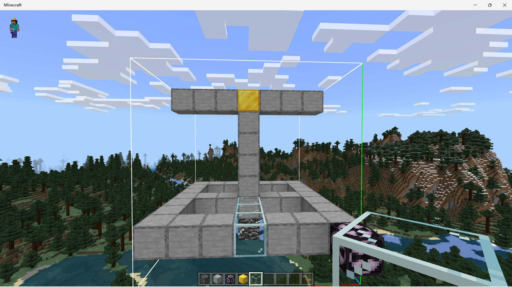
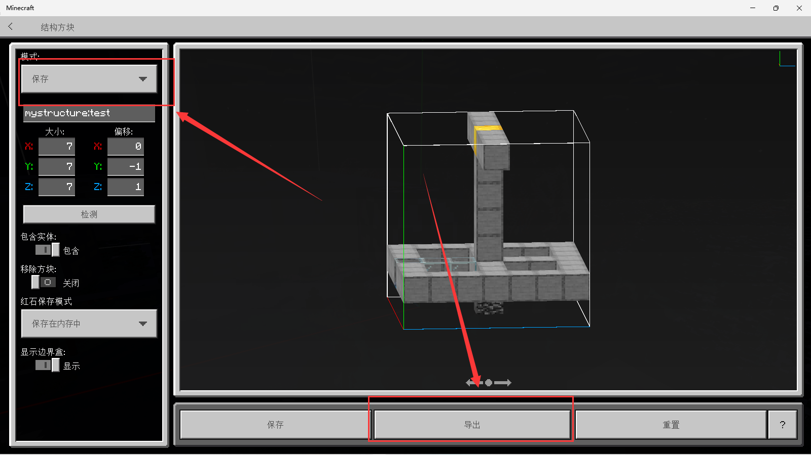
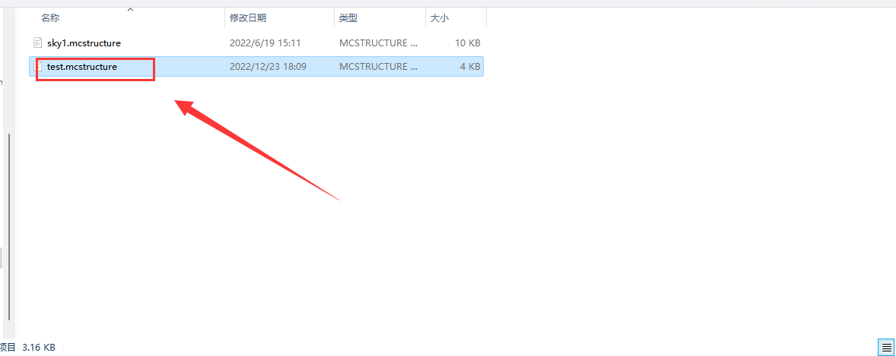
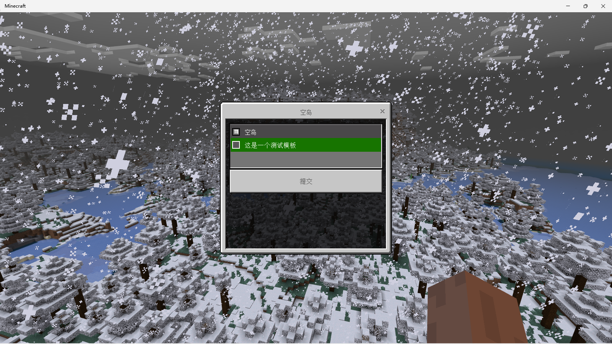
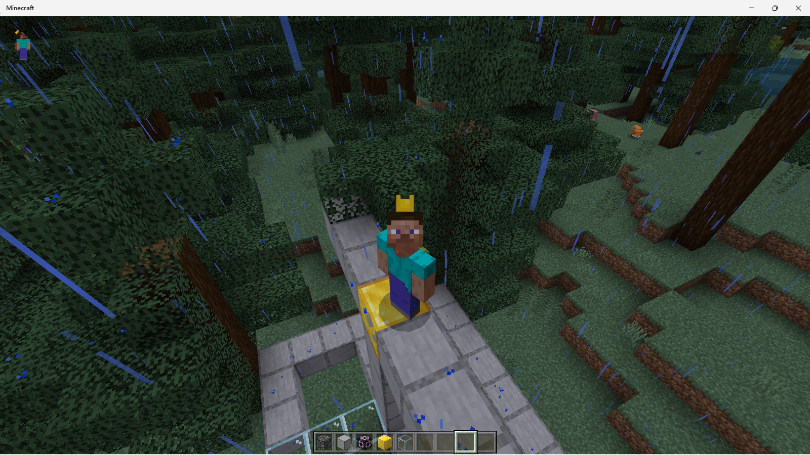

## 添加一个新的岛屿模板

1 . 首先在游戏内搭建一个岛屿 , 我以一个 7*7 的结构代替 如下图




2 . 然后使用结构方块导出结构 这里我命名为 test



3 . 将导出的 test.mcstructure 文件移动至BDS 的      \plugins\SkyBlock\structures 文件夹下




4 . 打开配置文件 \plugins\SkyBlock\config.json 

在配置中找到  isLand -> file 配置项 添加岛屿模板的偏移值

我们想要玩家创建岛屿后出生在金块的位置 , 可以按照下方进行填写

```javascript
    "isLand": {
        // 略....
        "file": [ 
            {
                "type": "sky1",
                "name": "空岛",
                "data": {
                    "length": 9,
                    "width": 9,
                    "height": 8
                }
            }

            // 在这里添加如下配置 : 
            ,{
                "type": "test", // 岛屿模板文件名
                "name": "这是一个测试模板", // 游戏内显示名

                // 偏移值 玩家的出生点坐标为  长/2  高   宽/2
                // 
                "data": {
                    "length": 7, 
                    "width": 7, 
                    "height": 7 
                }

            // 玩家会基于这个结构 , 出生在坐标 3.5 , 7 , 3.5 也就是金块的位置
            }
        ]
    }
```

5 . 重启服务器 , 输入 /is 即可看见我们新增的岛屿模板 





6 . 点击提交 会发现如预期一样 , 我们出生在金块的上方



